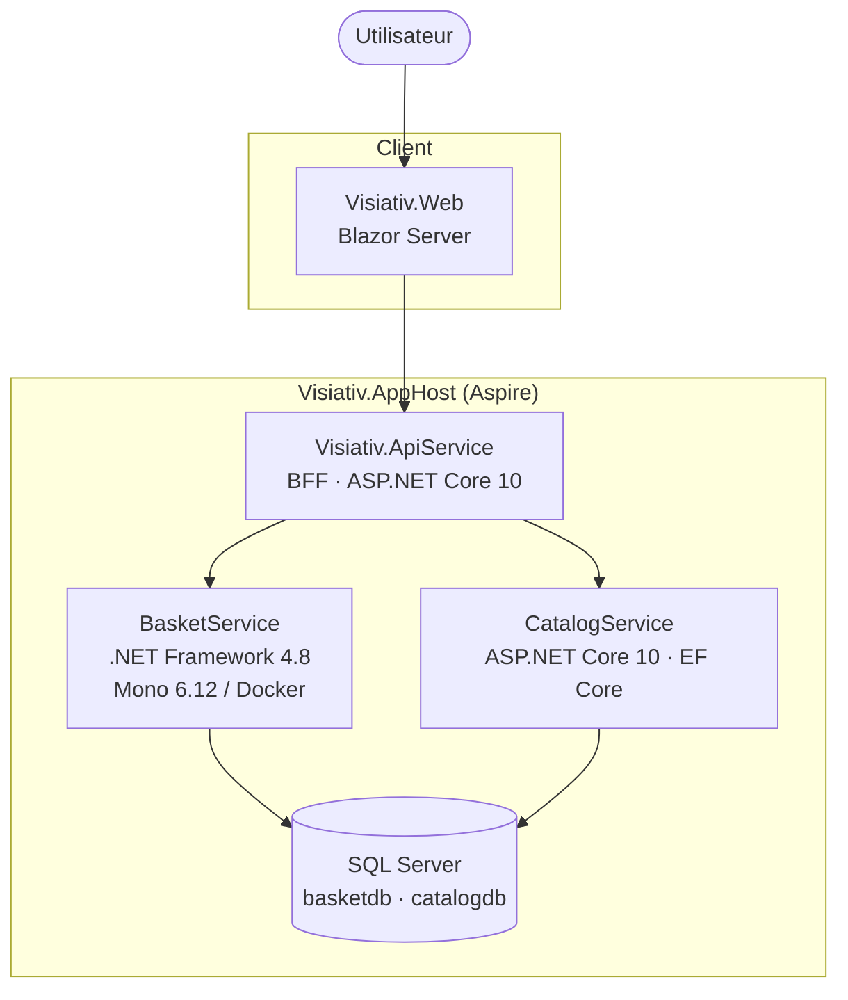
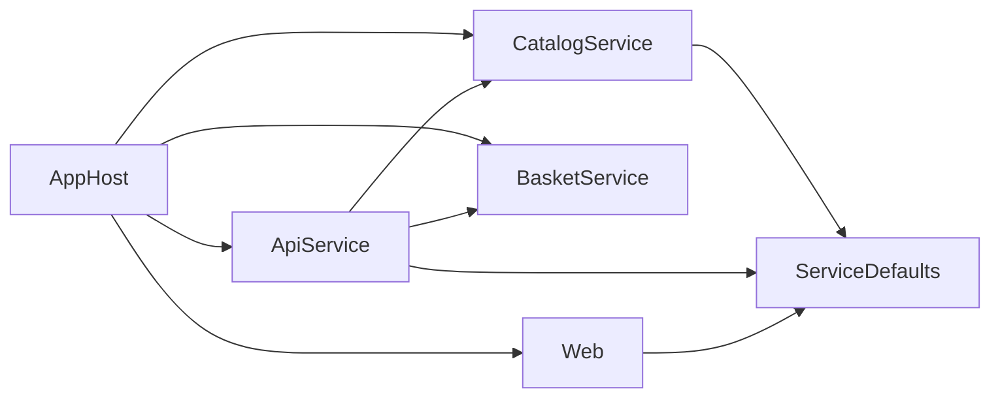
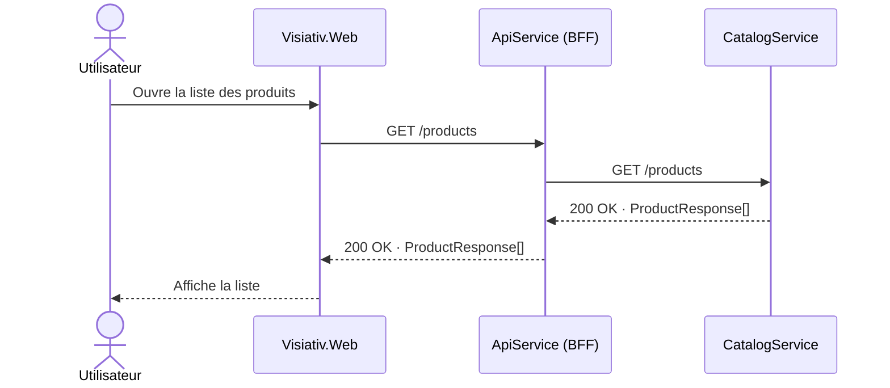
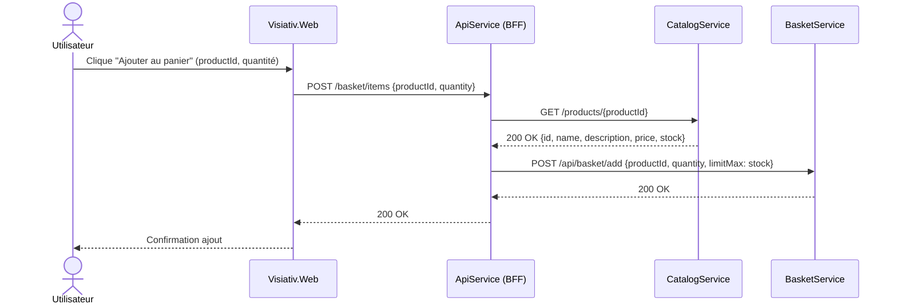
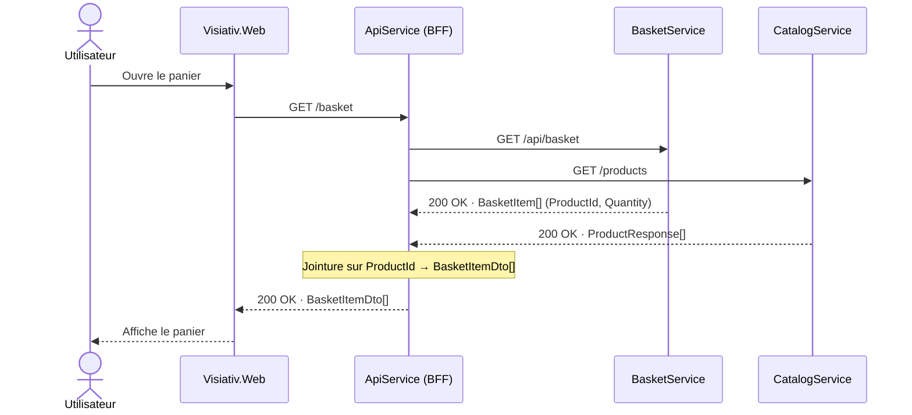
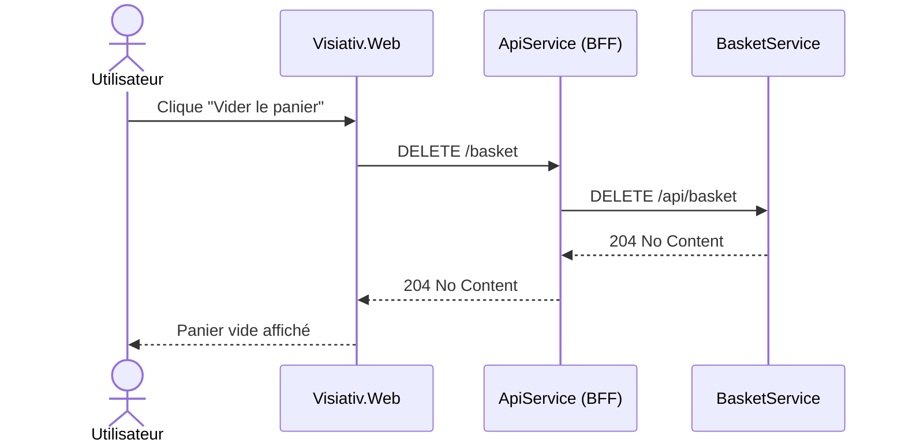

# Architecture

## Généralités

### Contexte

Mini application e-commerce permettant à un utilisateur de consulter un catalogue de produits, d'ajouter des articles à un panier et de visualiser son contenu. L'exercice démontre la cohabitation d'une **stack moderne** (ASP.NET Core 10) et d'une **stack legacy** (.NET Framework 4.8) au sein d'un même système orchestré.

---

## Architecture

## Liste des composants

| Composant | Rôle | Technologie | Port local |
|---|---|---|---|
| **Visiativ.AppHost** | Orchestrateur Aspire — déclare et relie toutes les ressources | .NET Aspire 10 | — |
| **Visiativ.ServiceDefaults** | Bibliothèque partagée — OpenTelemetry, health checks, service discovery, middlewares | ASP.NET Core 10 (lib) | — |
| **CatalogService** | Service catalogue — expose les produits en lecture | ASP.NET Core 10 · EF Core 10 · SQL Server | dynamique (Aspire) |
| **BasketService** | Service panier — stocke les lignes du panier (ProductId + Quantity) | ASP.NET .NET Framework 4.8.1 · ADO.NET · SQL Server · Mono 6.12 / XSP4 | 8080 (Docker) |
| **Visiativ.ApiService** | BFF — orchestre CatalogService et BasketService, point d'entrée unique du frontend | ASP.NET Core 10 Minimal API | dynamique (Aspire) |
| **Visiativ.Web** | Interface utilisateur | Blazor Server | dynamique (Aspire) |

---

## Schéma d'architecture globale



## Architecture applicative

### Structure de la solution

```
Visiativ/
├── Visiativ.slnx                          # Solution Visual Studio (format .slnx)
├── aspire.config.json                     # Configuration Aspire
├── README.md                              # Point d'entrée documentation
│
├── docs/
│   ├── 1_quick-start.md
│   ├── 2_architecture.md
│   ├── 3_technical-documentation.catalogservice.md
│   ├── 4_technical-documentation.basketservice.md
│   └── 5_technical-documentation.apiservice.md
│
├── src/
│   ├── Visiativ.AppHost/                  # Orchestrateur Aspire
│   │   └── AppHost.cs                     # Déclaration des ressources (SQL Server, services, Docker)
│   │
│   ├── Visiativ.ServiceDefaults/          # Bibliothèque partagée (net10)
│   │   ├── Extensions.cs                  # AddServiceDefaults, UseExceptionHandlingMiddleware,
│   │   │                                  # UseRequestLogging, MapDefaultEndpoints
│   │   ├── Middlewares/
│   │   │   ├── ExceptionHandlingMiddleware.cs  # Middleware catch-all partagé (log + JSON 500)
│   │   │   └── RequestLoggingMiddleware.cs     # Log structuré de chaque requête HTTP entrante
│   │   └── Networking/
│   │       └── OutboundHttpLoggingHandler.cs   # DelegatingHandler : log des appels HTTP sortants
│   │
│   ├── CatalogService/                    # → voir 3_technical-documentation.catalogservice.md
│   ├── BasketService/                     # → voir 4_technical-documentation.basketservice.md
│   ├── Visiativ.ApiService/               # → voir 5_technical-documentation.apiservice.md
│   └── Visiativ.Web/                      # Frontend Blazor Server (net10)
│
└── tests/
    ├── CatalogService.Tests/              # Tests intégration CatalogService (WebApplicationFactory)
    ├── Visiativ.ApiService.Tests/         # Tests intégration BFF (WebApplicationFactory + NSubstitute)
    ├── BasketService.Tests/               # Tests intégration BasketService (HttpServer WebAPI + NUnit)
    └── Visiativ.Web.Tests/                # Tests composants Blazor (bUnit + NSubstitute)
```

### Documentation détaillée par service

- [CatalogService](3_technical-documentation.catalogservice.md)
- [BasketService](4_technical-documentation.basketservice.md)
- [ApiService (BFF)](5_technical-documentation.apiservice.md)


### Dépendances entre composants



> **Note** : BasketService (.NET Framework 4.8.1) ne peut pas référencer Visiativ.ServiceDefaults (net10). Il dispose de ses propres mécanismes : `GlobalExceptionFilter` (ASP.NET WebAPI) pour la gestion des erreurs, `System.Diagnostics.Trace` pour le logging.

---

## Use Cases — Diagrammes de séquence

### 1. Consulter le catalogue produits

Proxy transparent : le BFF relaie la requête au CatalogService et retourne la liste triée par nom.



---

### 2. Ajouter un produit au panier

Le BFF orchestre deux appels en séquence : récupération du produit et du stock côté catalogue, puis ajout dans le panier.



---

### 3. Consulter le panier

Le BFF appelle les deux services en parallèle, puis consolide les résultats par jointure sur `ProductId`.



---

### 4. Vider le panier

Proxy transparent : le BFF relaie la demande au BasketService qui supprime toutes les lignes du panier.



---


## Choix techniques et justifications

### Aspire comme orchestrateur

Aspire élimine toute la configuration manuelle habituelle d'un environnement multi-services (ports, connection strings, ordre de démarrage, health checks). La totalité de l'orchestration est déclarative dans `AppHost.cs`. Le dashboard intégré offre une supervision immédiate sans infrastructure observabilité supplémentaire.

### Mono 6.12 / XSP4 pour BasketService

Le test impose .NET Framework 4.8 pour le BasketService. Pour s'intégrer dans un environnement Docker/Linux comme les autres services (et éviter les Windows containers qui nécessitent une configuration spécifique de Docker Desktop), l'image `mono:6.12` avec le serveur `xsp4` a été retenue. MSBuild compile le projet en ciblant `v4.7.2` (limitation de compatibilité Mono), ce qui est transparent pour le comportement applicatif.

### BFF Pattern

Le frontend ne connaît qu'un seul point d'entrée. Le BFF est responsable de l'orchestration (appel catalogue + vérification stock + appel panier) et de la consolidation des données (enrichissement des items du panier avec les infos catalogue via `BasketItemDto`). Les services backend restent internes et non exposés directement.

### Minimal API pour CatalogService et le BFF

Les Minimal APIs d'ASP.NET Core réduisent la cérémonie pour des services dont les endpoints sont peu nombreux et clairement délimités. Le routage déclaratif reste lisible et les endpoints sont facilement testables via `WebApplicationFactory`.

### ADO.NET + MERGE SQL pour BasketService

Contrainte du test. L'opération `MERGE` garantit l'idempotence de l'ajout au panier (upsert sur `ProductId`) sans nécessiter de logique applicative de détection de doublon.

### Architecture hexagonale partielle sur BasketService

`IBasketItemRepository` (port SPI) permet de mocker le repository dans les tests sans toucher à l'infrastructure ADO.NET. Le domaine (`AddItemToBasket`, `GetBasket`, `DeleteBasket`) reste testable en isolation.

### Séparation des données dans le panier

Le BasketService ne stocke que `ProductId` et `Quantity` — les informations produit (nom, prix, description, stock) viennent exclusivement du CatalogService. Cette séparation évite la duplication et la désynchronisation des données : le prix affiché dans le panier est toujours le prix catalogue en vigueur au moment de la consultation.

---

## Limites connues et pistes d'amélioration

### Limites

**Panier unique / pas d'authentification** — Le panier est une table plate sans notion de session ou d'utilisateur. Tous les visiteurs partagent le même panier. L'ajout d'une colonne `UserId` ou d'un système de session serait nécessaire pour une application réelle.

**Race condition sur le stock** — La vérification du stock est faite dans le BFF (lecture depuis CatalogService), mais l'ajout dans le panier est une opération séparée dans BasketService. Entre les deux appels, le stock peut avoir changé (achat concurrent). Une solution correcte impliquerait une réservation atomique côté CatalogService.

**Panier dépendant du catalogue** — Si le CatalogService est indisponible, la consultation du panier échoue (le BFF ne peut pas enrichir les items). Une stratégie de cache ou un fallback dégradé (retourner les items sans enrichissement) améliorerait la résilience.

**Route de diagnostic exposée** — `GET /api/basket/test` retourne la connection string SQL en clair. Ce endpoint de debug doit être supprimé avant toute mise en production.

**Mono EOL** — L'image `mono:6.12` repose sur Debian Buster (fin de vie). Les sources APT sont redirigées vers les archives Debian dans le `Dockerfile`. Acceptable pour un contexte de démonstration, à adresser si le service est amené à vivre en production.

**Logging basique sur BasketService** — Le `GlobalExceptionFilter` utilise `System.Diagnostics.Trace` (pas d'intégration OpenTelemetry). En production, une intégration avec un logger structuré (Serilog ou NLog avec sink OpenTelemetry) serait recommandée.

### Pistes d'amélioration

- Ajouter une gestion de session (cookie ou JWT léger) pour isoler les paniers par utilisateur.
- Introduire une réservation de stock dans CatalogService pour éliminer la race condition.
- Ajouter un cache court terme (Redis ou in-memory) sur le `GET /products` dans le BFF pour réduire la dépendance synchrone au CatalogService lors de la consultation du panier.
- Remplacer Mono/XSP4 par une migration vers .NET 8+ dans une démarche de modernisation progressive.
- Centraliser le logging de BasketService vers OpenTelemetry pour une traçabilité unifiée dans le dashboard Aspire.
- Ajouter des tests d'intégration end-to-end (AppHost Aspire + vrai SQL Server en test) avec `Aspire.Hosting.Testing`.
