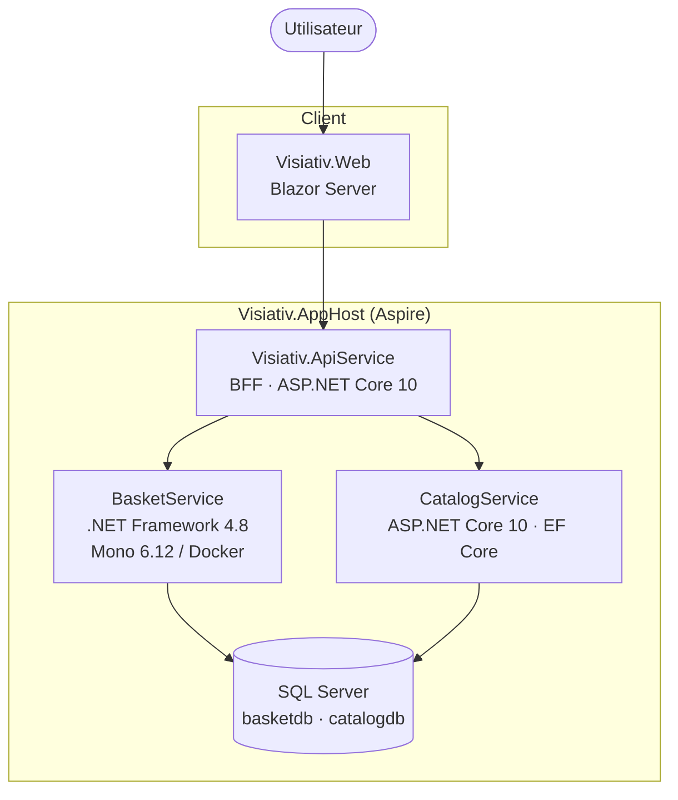
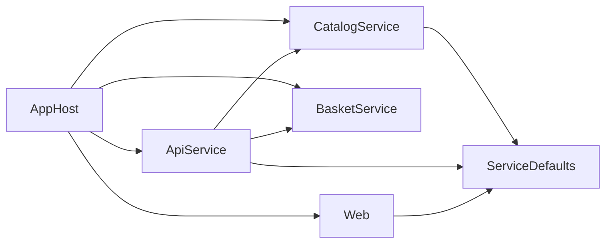
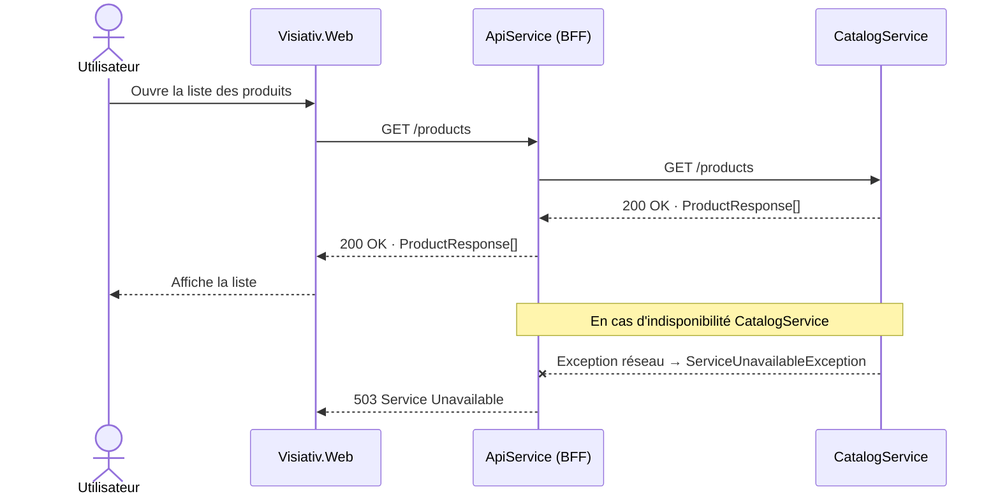
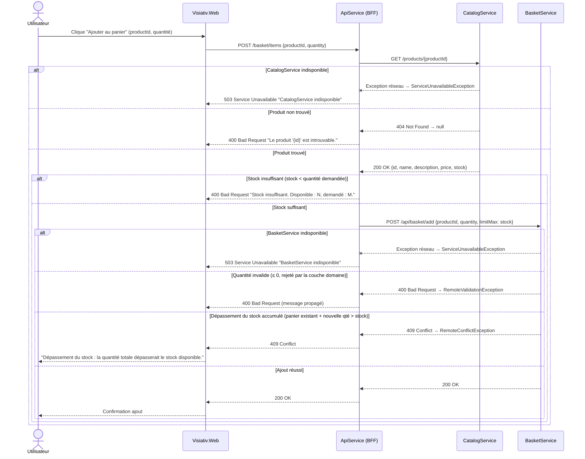
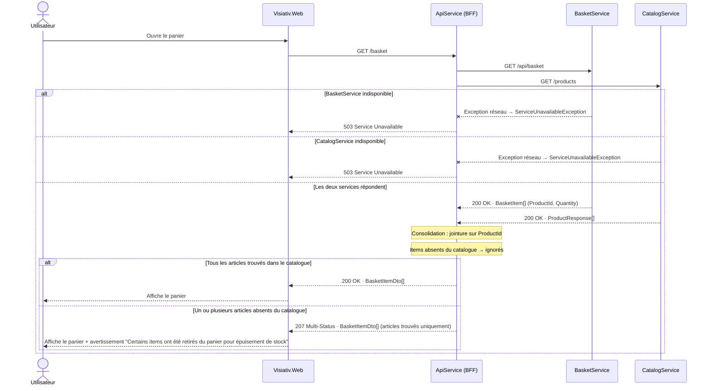
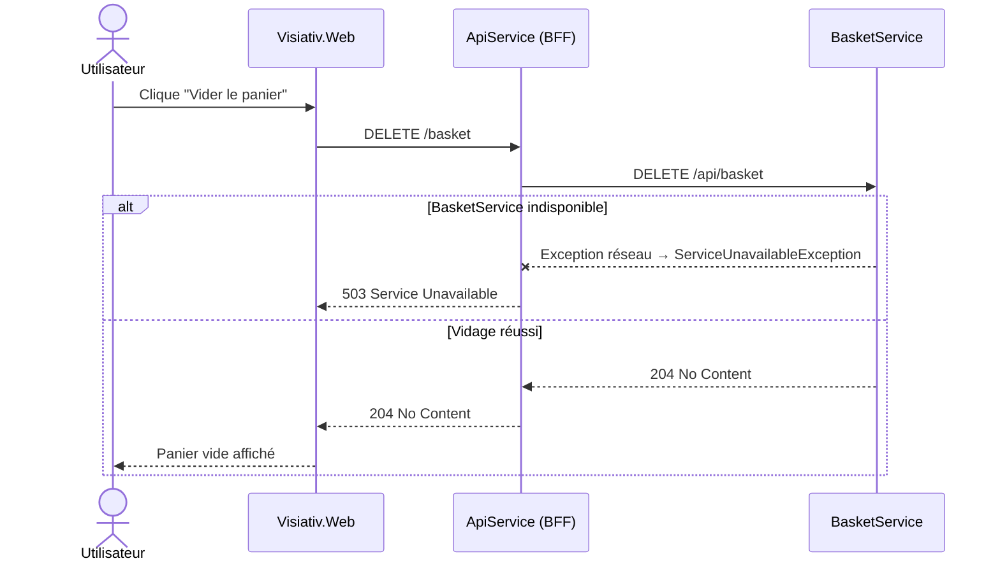

# Architecture

## Généralités

### Contexte

Mini application e-commerce permettant à un utilisateur de consulter un catalogue de produits, d'ajouter des articles à un panier et de visualiser son contenu. L'exercice démontre la cohabitation d'une **stack moderne** (ASP.NET Core 10) et d'une **stack legacy** (.NET Framework 4.8) au sein d'un même système orchestré.

### Approche retenue — .NET Aspire + Docker

[.NET Aspire](https://learn.microsoft.com/fr-fr/dotnet/aspire/get-started/aspire-overview) a été retenu comme solution d'orchestration locale pour les raisons suivantes :

- **Service discovery automatique** : les services se référencent par nom (`http://catalogservice`, `http://basketservice`) sans configuration manuelle de ports.
- **Provisioning des ressources** : le conteneur SQL Server (et ses deux bases) est déclaré dans l'AppHost et démarré automatiquement.
- **Health checks et démarrage ordonné** : le BFF attend la disponibilité du CatalogService avant de démarrer (`WaitFor`).
- **Dashboard de supervision intégré** : traces, logs et métriques centralisés via OpenTelemetry sans infrastructure supplémentaire.
- **Gestion du service legacy** : BasketService est enregistré comme ressource Docker (`AddDockerfile`) — Aspire gère son cycle de vie comme n'importe quel service.
- **Confort pour les développeurs** : n'importe quel développeur souhaitant explorer la solution n'a besoin que de Docker Desktop et du SDK .NET 10. Un seul F5 démarre l'intégralité de la stack (SQL Server, BasketService sous Mono, CatalogService, BFF, frontend). Pas de configuration manuelle de base de données, de ports ou de variables d'environnement.

---

## Présentation des briques

| Composant | Rôle | Technologie | Port local |
|---|---|---|---|
| **Visiativ.AppHost** | Orchestrateur Aspire — déclare et relie toutes les ressources | .NET Aspire 10 | — |
| **Visiativ.ServiceDefaults** | Bibliothèque partagée — OpenTelemetry, health checks, service discovery, middlewares | ASP.NET Core 10 (lib) | — |
| **CatalogService** | Service catalogue — expose les produits en lecture | ASP.NET Core 10 · EF Core 10 · SQL Server | dynamique (Aspire) |
| **BasketService** | Service panier — stocke les lignes du panier (ProductId + Quantity) | ASP.NET .NET Framework 4.8.1 · ADO.NET · SQL Server · Mono 6.12 / XSP4 | 8080 (Docker) |
| **Visiativ.ApiService** | BFF — orchestre CatalogService et BasketService, point d'entrée unique du frontend | ASP.NET Core 10 Minimal API | dynamique (Aspire) |
| **Visiativ.Web** | Interface utilisateur | Blazor Server | dynamique (Aspire) |

---

## Schéma global

### Dépendances entre composants

> **Note** : BasketService (.NET Framework 4.8.1) ne peut pas référencer Visiativ.ServiceDefaults (net10). Il dispose de ses propres mécanismes : `GlobalExceptionFilter` (ASP.NET WebAPI) pour la gestion des erreurs, `System.Diagnostics.Trace` pour le logging.

---

## Use Cases — Diagrammes de séquence

### 1. Consulter le catalogue produits

---

### 2. Ajouter un produit au panier

C'est le flux le plus riche : le BFF orchestre deux appels en séquence et gère tous les cas d'erreur métier.

---

### 3. Consulter le panier

Le BFF consolide les données du panier (ProductId + Quantity) avec le catalogue (Name, Description, Price, Stock) pour construire une vue enrichie. Si un article du panier n'est plus référencé dans le catalogue, il est ignoré et une réponse partielle est retournée.

---

### 4. Vider le panier

